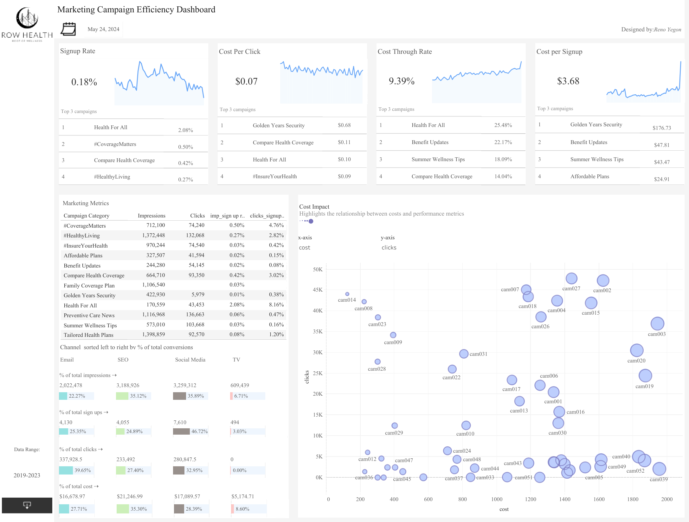
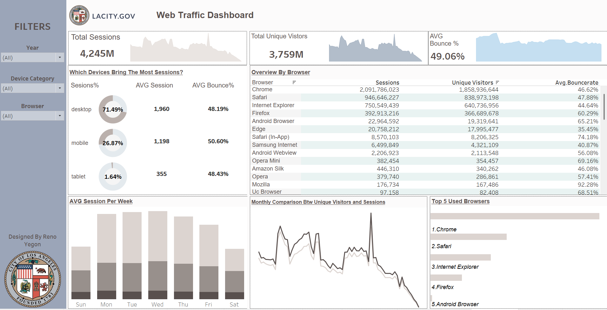
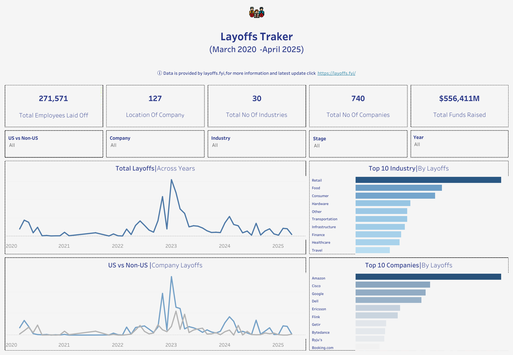
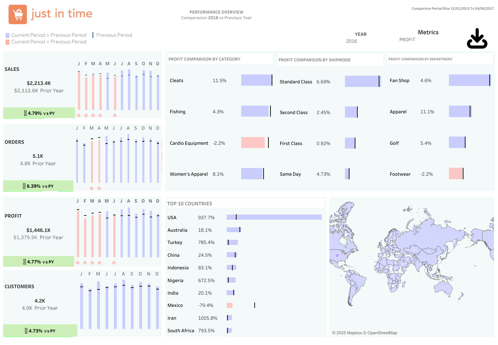

## Tableau-Portfolio

A collection of my Tableau dashboards, highlighting my ability to transform data into actionable insights. These projects demonstrate my strengths in data visualization, KPI tracking, and storytelling through data, using real-world datasets to uncover trends, measure performance, and support decision-making.

---

# Table of Contents

 
[Dashboards](#section_1) 
[Part 1: Row Health – Marketing Campaign Efficiency Dashboard](#section_2) 
[Part 2:LACITY.GOV Web Traffic Dashboard](#section_3) 
[Part 3:Massachusetts General Hospital (MGH) KPI Dashboard](#section_4) 
[Part 4: Layoffs Tracker Dashboard](#section_5) 
[Part 5: Supply Chain Performance Dashboard](#section_6) 

### 📂Dashboards

---

#### 📈 Row Health – Marketing Campaign Efficiency Dashboard

* **Purpose:**
  Evaluates digital and offline marketing campaign effectiveness across signup rates, costs, and engagement metrics for health services.

* **Use Case:**
  Useful for marketing managers, digital strategists, and campaign analysts optimizing ad spend, refining messaging, and boosting healthcare campaign ROI.

  

   
  <a href="https://public.tableau.com/views/RowHealthWellnessProgramAnalysis/Dashboard1?:language=en-US&:sid=&:redirect=auth&:display_count=n&:origin=viz_share_link" target="_blank">
   🔗 View Row Health Interactive Dashboard on Tableau Public
  </a>

---

#### 📈 LACITY.GOV Web Traffic Dashboard

* **Purpose:**
  Tracks web traffic and user behavior for Los Angeles City’s online portals by browser, device, and time.

* **Use Case:**
  Valuable for UX/UI designers, city IT teams, and communication departments optimizing website performance and user engagement.

  

   
  <a href="https://public.tableau.com/views/LAcity_Web_Traffic/Dashboard1?:language=en-US&:sid=&:redirect=auth&:display_count=n&:origin=viz_share_link" target="_blank">
    🔗 View LACITY Web Traffic Dashboard on Tableau Public
  </a>

---

#### 📈 Massachusetts General Hospital (MGH) KPI Dashboard

* **Purpose:**
  Monitors patient encounters, average hospital stay, cost per visit, insurance coverage, and admission trends from 2011 to 2022 at Massachusetts General Hospital.

* **Use Case:**
  Ideal for hospital administrators, healthcare analysts, and policy makers tracking hospital performance, resource planning, and insurance behavior over time.

  

   
  <a href="https://public.tableau.com/views/MassachusettsGeneralHospitalMGHKPIReport/Dashboard1?:language=en-US&:sid=&:redirect=auth&:display_count=n&:origin=viz_share_link" target="_blank">
   🔗 View MGH Interactive Dashboard on Tableau Public
  </a>

---

#### 📈 Layoffs Tracker Dashboard

* **Purpose:**
  Tracks layoffs across industries and companies globally, highlighting trends over a 5-year period.

* **Use Case:**
  Ideal for investors, policy analysts, or HR consultants monitoring economic stress signals and employment trends in tech and retail.

  

   
  <a href="https://public.tableau.com/views/Layoffs_17462916401030/Dashboard1?:language=en-US&:sid=&:redirect=auth&:display_count=n&:origin=viz_share_link" target="_blank">
    🔗 View Layoffs Interactive Dashboard on Tableau Public
  </a>

---

#### 📈 Just in Time – Supply Chain Performance Dashboard

* **Purpose:**
  Analyzes year-over-year performance metrics such as sales, orders, profit, and customer growth across product categories, regions, and departments.

* **Use Case:**
  Useful for retail managers, logistics planners, and analysts to monitor supply chain health and profit contribution by geography and category.

  

   
  <a href="https://public.tableau.com/views/SupplyChain_17444950551660/Dashboard1?:language=en-US&:sid=&:redirect=auth&:display_count=n&:origin=viz_share_link" target="_blank">
    🔗 View Supply Chain Interactive Dashboard on Tableau Public
  </a>

---
